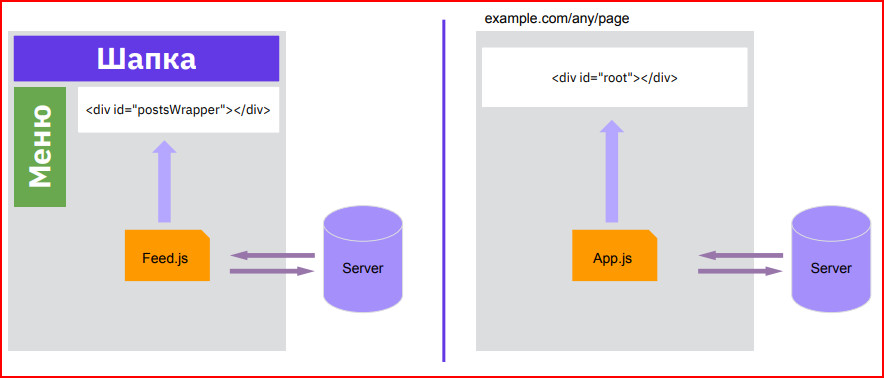

# Урок 1. Знакомство с React и первые компоненты. Работа с JSX

[Learn React](https://react.dev/)
## Зачем изучать React?
* Самый востребованный фреймворк в современной фронтенд-разработке.
* Кроссплатформенность: не только сайты, но и мобильные приложения.
* Аналоги: Vue и Angular

## Темы урока
* Single Page Application
* Webpack
* Babel
* Первое приложение на React

### Стандартный подход vs SPA 

### Плюсы SPA
* Можно реализовать сложную логику
* Быстрая работа
* Экономия трафика
* Запросов на сервер больше, но они проще
* Простые способы реализовать кеширование

### Минусы 

* Долгая первая загрузка
* Нужно хорошо знать не только HTML, но и JS
* Проблемы с SEO

## Webpack & Babel

Плюсы webpack
* Генерация нескольких файлов (в том числе содержащих по несколько модулей сразу)
* Динамическая подгрузка файлов 
* Масса плагинов для обработки кода
* Динамическое обновление кода во время его работы без потери состояния программы

## Аналоги webpack
* Gulp
* Grunt
* Parcel
* Browserify

Yfxfkj hf,jns
# Начало 
* [Getting started](https://create-react-app.dev/docs/getting-started/)
* npx create-react-app my-app
* cd my-app
* npm start

# Сокращения 

## **ffc** создает компонет 
## **usf** Создать useState
## **use** Создать useEffect